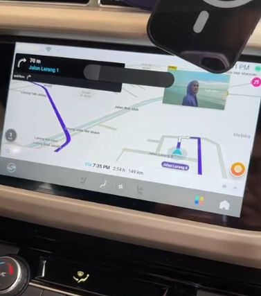

# X70 ATLAS

## Protection
ATLAS OS has APK installation protection in package manager service where if the APK is not coming from AStore, it will refuse installation.

Around late April 2023, ACOTech released firmware which added signature checking before APK installation. We haven't looked for any loophole in this firmware yet. So to sideload the apps, user must first downgrade to earlier firmware first.

## Offline Upgrade/Downgrade

The ability to offline upgrade/downgrade will not be shared here for now.